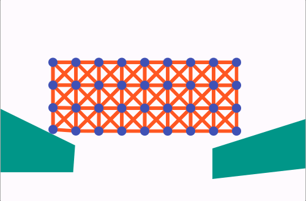

# Soft Body Simulation in Flutter

## Overview

Welcome to the Soft Body Simulation project implemented in Flutter! This project aims to demonstrate
the simulation of soft bodies using Flutter's capabilities, without relying on external physics or
game engines.

Inspired by Gonkee's fantastic video explaining the physics and formulas behind soft body
simulations, I decided to dive into the world of mass-spring models and bring it to life in Flutter.

[Watch the Inspiring Video](https://www.youtube.com/watch?v=kyQP4t_wOGI)

## Key Features

- **Accumulation of Forces:** Incorporates gravity, spring forces (following Hooke's Law), and more
  to create a dynamic and realistic soft body.

- **Velocity and Position Updates:** Utilizes Euler's integration to continuously update the
  velocity and position of each mass point for smooth and lifelike movement.

- **Collision Detection:** Implements ray casting for collision detection, allowing the soft body to
  interact realistically with its environment.

   

## Project Details

This project has been an incredible learning experience, and I'm excited to share it with the
Flutter and developer communities. I hope it serves as a source of inspiration and education for
fellow tech enthusiasts and developers.

Feel free to explore the code, provide feedback, or simply enjoy the mesmerizing motion of soft
bodies!

## Support and Contact

For questions or inquiries, please feel free to reach out to me.

Thank you for your support! Don't forget to star this repository and share it with others who might
find it interesting.
